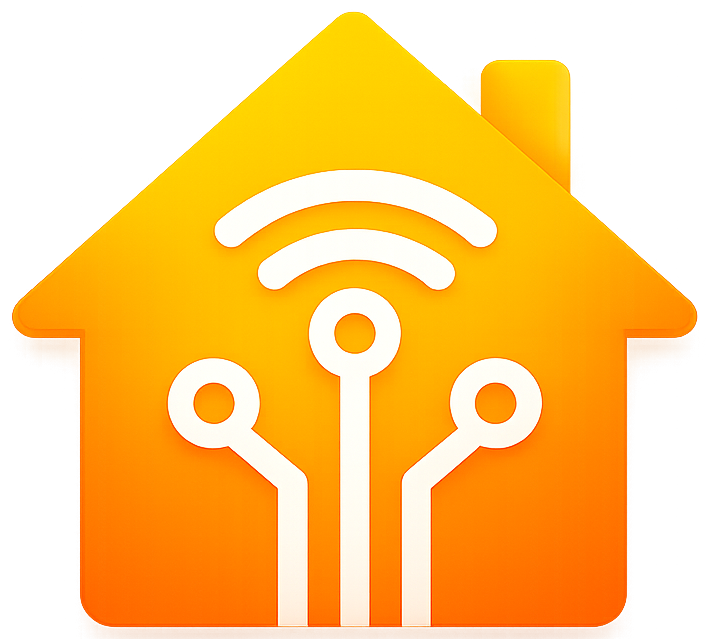

<p align="center"></p>

🇬🇧 [English](README.md) | 🇪🇸 **Español**

# Configurador MEPLHAA

Generador visual de configuraciones JSON (script MEPLHAA) para dispositivos con firmware **HAA v12 "Merlin"** ([RavenSystem esp-homekit-devices](https://github.com/RavenSystem/esp-homekit-devices)). Es una web local, sin instalación ni build: solo HTML/CSS/JS.

## Uso rápido

1. Descomprime el zip (o clona/descarga la carpeta `haa-web`).
2. Abre una terminal en esa carpeta y arranca un servidor estático, por ejemplo:
   ```
   python -m http.server 8096
   ```
3. Abre `http://localhost:8096` en el navegador.

También puedes usar cualquier otro servidor estático (Live Server de VS Code, `npx serve`, etc.) — son ficheros planos, no requieren Node ni build.

> Nota: abrir `index.html` con doble clic (`file://`) puede fallar por restricciones del navegador al cargar los ficheros `.js`. Usa siempre un servidor local como el del paso 2.

## ¿Qué puedes hacer con esta web?

- **Elegir un dispositivo de ejemplo** (opcional): arriba del todo hay un selector en 3 pasos — Fabricante → Modelo → Ejemplo/función — con más de 230 configuraciones ya hechas (dispositivos oficiales de la wiki de RavenSystem + ejemplos migrados y aportados por la comunidad). Selecciona "Personalizado" para partir de cero, o para explorar todos los ejemplos disponibles en un único desplegable.
- **Asistente paso a paso**: guía por preguntas para ir montando la configuración accesorio por accesorio.
- **Formulario avanzado**: acceso directo a Configuración General, GPIOs y Accesorios, con todos los campos disponibles.
- **Pegar un JSON existente**: en el panel derecho, pega tu script actual y pulsa "Cargar en el formulario" para editarlo visualmente. Si el JSON es de una versión anterior (v11 "Peregrine"), se **convierte automáticamente a v12** al cargarlo (te avisa de ello). El formulario y el JSON generado están siempre sincronizados en ambos sentidos.
- **Convertidor v11 → v12**: una tarjeta específica donde pegar una configuración antigua y convertirla al formato actual sin cargarla (útil solo para convertir y copiar).
- **Guardar tus configuraciones y compartirlas**: guarda tus MEPLHAA en el navegador y recupéralos cuando quieras; además puedes proponerlos al catálogo oficial para que los use toda la comunidad.

El asistente y el formulario avanzado comparten el mismo estado: puedes empezar en uno y continuar en el otro sin perder nada.

### Configuración General

Hostname, tipo de salida de log, GPIO y comportamiento del LED de estado, botón(es) de modo configuración, y un campo de JSON avanzado para opciones generales no cubiertas por el formulario (I2C, expansores de GPIO, UART, horarios, acciones de sistema...).

### GPIOs ("io")

Desde HAA v12 Merlin, cada GPIO usado debe declararse antes de que un accesorio lo use: modo (entrada, salida, PWM, ADC...), pull-up/down y parámetros adicionales. Cada GPIO se muestra en su propia fila, con una etiqueta automática (**Relé**, **LED** o **Botón**) que indica cómo lo está usando la configuración actual — incluyendo relés agrupados dentro de servicios extra de otros accesorios.

### Accesorios

Cada accesorio corresponde a un tipo de servicio HomeKit (interruptor, enchufe, sensor, válvula de agua, termostato, bombilla, persiana, cerradura...). Al elegir un tipo verás un panel plegable "¿Qué se puede configurar en este tipo?" con las claves JSON reales disponibles, según la documentación oficial de RavenSystem.

Si un dispositivo agrupa varios relés/sensores en un solo accesorio mediante servicios extra (`es`), la web los separa **automáticamente** en tarjetas independientes y totalmente editables al cargar el dispositivo o pegar el JSON — no hace falta ningún paso manual. (Ten en cuenta que separarlos hace que aparezcan como tarjetas independientes en la app Home, en vez de una sola tarjeta con varios controles).

### JSON generado

Panel derecho, siempre actualizado en vivo. Botones disponibles:
- **Ocultar valores por defecto**: simplifica el JSON quitando claves que ya están en su valor por defecto.
- **Una sola línea**: compacta el JSON para copiar/pegar rápido.
- **Copiar**: copia el JSON al portapapeles.

Debajo se muestran avisos de validación si algo en la configuración no es coherente.

### Convertidor v11 "Peregrine" → v12 "Merlin"

Las configuraciones antiguas usaban las acciones con los GPIOs como objetos (`{"g":12,"v":1}`) y no llevaban el bloque `io` central. Para pasarlas al formato actual tienes dos vías:

- **Automático**: al pegar un JSON antiguo en "Pegar JSON existente" y pulsar "Cargar", se detecta y se convierte solo a v12 (con un aviso).
- **Manual**: la tarjeta "Convertidor de MEPLHAA antigua (v11) → v12" convierte y te muestra el resultado para copiarlo, sin cargarlo en el formulario.

La conversión pasa las acciones de relé (`r`) y botón (`b`/`f[n]`) a formato array, y **reconstruye el `io` central** a partir de los GPIOs usados (salidas de `r` + el LED como modo 2, entradas de `b`/`f[n]` como modo 6). Es idempotente: si le pasas algo que ya es v12, no lo toca. Nota: los botones se declaran como entrada simple (modo 6); algunos botones físicos necesitan pull-up (`6,1`), revísalo en el `io`.

### Mis configuraciones guardadas

Puedes guardar tus propias configuraciones en el navegador como una entrada más de la galería, rellenando **marca, dispositivo, función, descripción y autor** (opcional). Aparecen en el selector de dispositivos de arriba, bajo la marca **⭐ Mis guardados**, y se cargan igual que cualquier otro ejemplo.

- Se guardan **solo en tu navegador/dispositivo** (localStorage). No se sube nada a ningún sitio; si borras los datos del navegador, se pierden.
- Cada guardado tiene un botón **Compartir**, que abre una propuesta (issue) en GitHub ya rellena con todos los datos y el JSON, para proponerlo al **catálogo oficial** y que lo use toda la comunidad (tras una revisión).

### Idioma

Selector ES/EN arriba a la derecha, para toda la interfaz interactiva, incluido el catálogo de dispositivos (nombre de ejemplo y descripción). Las tablas de referencia por tipo de accesorio ("¿qué se puede configurar en este tipo?") siguen solo en español por ahora.

## Estructura del proyecto

```
haa-web/
├── index.html      Estructura de la página
├── style.css       Estilos
├── app.js          Lógica de la aplicación (estado, render, generación de JSON)
├── devices.js       Catálogo de dispositivos/ejemplos preconfigurados
├── i18n.js          Textos ES/EN
├── typeInfo.js      Información de referencia por tipo de accesorio (wiki RavenSystem)
├── favicon.svg
└── VERSION.txt      Historial de versiones/cambios
```

No hay dependencias externas ni paso de build: todo es JS vanilla que se ejecuta tal cual en el navegador.

## Cómo aportar un dispositivo al catálogo

¿Tienes un dispositivo que no está en el catálogo? Hay varias formas de aportarlo, según tus conocimientos:

**La más fácil — desde la propia web**
Configura tu dispositivo, guárdalo en "Mis configuraciones guardadas" (con marca, modelo, función, descripción y autor) y pulsa **Compartir**: se abre una propuesta en GitHub ya rellena con todos los datos y el JSON. Solo tienes que enviarla (necesitas una cuenta de GitHub). Nosotros la revisamos y la añadimos al catálogo.

**No sé programar — solo quiero sugerirlo**
Abre un [issue en GitHub](https://github.com/haaconfig/meplhaa-configurator/issues/new/choose) con la plantilla "Sugerir un dispositivo". Cuenta más info (marca, modelo, enlace a su ficha en la wiki de RavenSystem o en [templates.blakadder.com](https://templates.blakadder.com/), y los GPIOs si los conoces), más fácil será añadirlo correctamente.

**Sé programar — quiero añadirlo yo mismo**
1. Abre [`devices.js`](devices.js) y busca la sección `Otros` (o la de tu fabricante).
2. Añade una línea con este formato:
   ```js
   { category: "Otros", model: "Marca Modelo (chip)", example: "Descripción corta", exampleEn: "Short description in English", description: "Descripción más larga si hace falta", descriptionEn: "Longer description in English if needed", config: cfg('{"c":{...},"a":[...]}') },
   ```
   Si no puedes escribir el `exampleEn`/`descriptionEn` en inglés, no pasa nada — mándalo solo en español y lo traduzco yo al añadirlo.
3. Reglas importantes (para no dar información incorrecta a otros usuarios):
   - **No inventes GPIOs ni valores de calibración.** Usa solo datos que puedas verificar: la wiki de RavenSystem, la página del dispositivo en [templates.blakadder.com](https://templates.blakadder.com/) (para el pinout — ojo, ese sitio es de Tasmota, no de HAA, así que solo sirve para sacar los GPIOs, no la configuración HAA en sí), o tu propia prueba en hardware real.
   - Si el chip de medidor de potencia no tiene calibración documentada para HAA, dilo en la `description` en vez de inventar cifras — puedes usar el valor de partida oficial `{"vf":0.1,"cf":0.1,"pf":1}` que indica la wiki (ver página "Power-Monitor"), dejando claro que hay que calibrarlo.
   - Si algo es una adaptación tuya (no documentada oficialmente), márcalo con ⚠ en el nombre y explícalo en la descripción.
   - Comprueba que el JSON es válido (pégalo en el propio configurador, en "Pegar JSON existente", y mira que no salgan errores ni avisos).
4. Manda un Pull Request. Si puedes, indica de dónde sacaste los datos (enlace a la wiki/Blakadder) en la descripción del PR, así se puede verificar rápido.

## Referencias

- [Wiki de RavenSystem esp-homekit-devices](https://github.com/RavenSystem/esp-homekit-devices/wiki) — documentación oficial del firmware HAA.
- [Colección de scripts de ejemplo de la comunidad (issue #689)](https://github.com/RavenSystem/esp-homekit-devices/issues/689) — fuente de parte del catálogo incluido aquí (migrado de v11 "Peregrine" a v12 "Merlin").

## Versión

Consulta [`VERSION.txt`](VERSION.txt) para el historial de cambios de esta configuradora.
